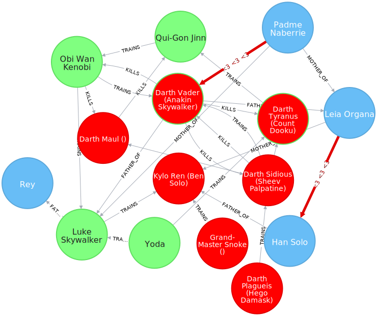

# Neo4j Datasets

[Neo4j](http://neo4j.com/) is a graph database. It uses a query language called _Cypher_.

## NoSQL Graph
A small graph showing the main hierachy of NoSQL datastores.

- nosql_dll.cql: Cypher script to create the graph
- nosql.cql: some queries
- nosql.grass: Stylesheets for the graph

## Star Wars Jedi / Sith Geanealogy
This graph shows the relationships between the Jedi and Sith from the Star Wars movies.

- sw_force_dll.cql: Cypher script to create the graph
- sw_force.cql: some interesting queries
- sw_force.grass: Stylesheets for the graph

